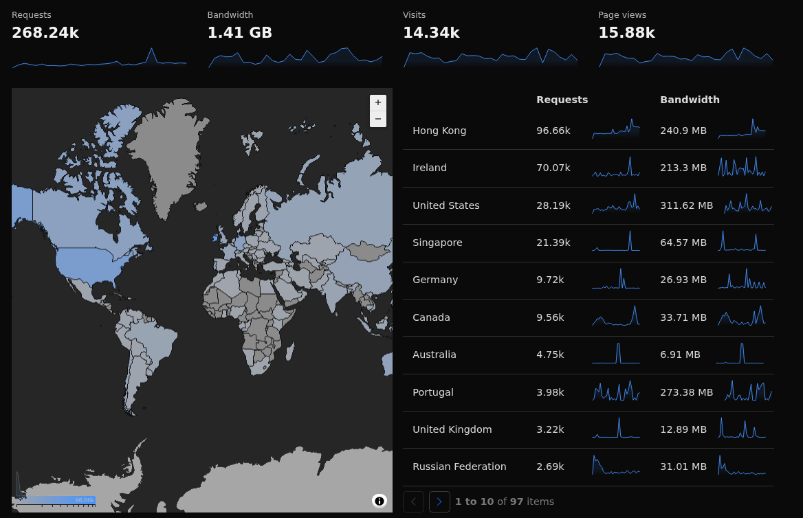

# Monkey Blog, Monkey Thoughts

## Monkey notes about domain statistics: 7 of July 2025

Last year, the number of visits of the main sub-domain [Art](https://art.odicforcesounds.com) grow, and for the first time I could rich **Hong Kong**, which in the aspect of how many visits I get per month, the number is bigger then **USA**, that was for long time, the first on "how many visits I have in odicforcesounds.com". 

I feel good to see this results, just because I believe that **Chinese** will agree about my interpretation of the 道, which I describe as [The Style of God](https://art.odicforcesounds.com/pages/YinYang/Dao/index.html), which is all about, what we do, what we create, what we become. I become a Monkey and I do a lot of reading and writing, even if sometimes I talk alone. ;)

**Ireland** is as well a country that "visit a lot" this website. I think there is a **Myth** about **Dragons** in old Ireland cultures. I don't know why, but there are a lot of cultures that like **Dragons**, even **Japan** and many others.

## The Style of God

Imagination(**Knowledge**) **+** Logic(**Rationality**) **=** Application(**Philosophy**)

Which means: 1 + 1 = 1 OR 3 道 (Dao/Tao)

The **Dao** is the Path, and the [Path](https://art.odicforcesounds.com/pages/Data/Audio/Dao_Expression/tracks/03_Path_of_the_Sun_Keepers/index.html) is simple.

Then we have the [Tao](https://art.odicforcesounds.com/pages/YinYang/Tao/index.html), which is the condition. 
The condition is not always easy, but by the illusion to archive it, is possible.

Our ability to imagine is based on what we know. 
That is how we create new ideas, positive or false, but possible to create them in reality, as a image, text or static object, while this days, objects can move and even talk, with A.I. 
What ever is the Logic Path we select, we will create an expression with that, which is the [Application](https://wiki.odicforcesounds.com). 

Old knowledge that make sense to me, while the principles of creation, being part of what we can imagine, is based on the concept of **Maya** from **Hinduism**, and is in fact as well, part of how **Zen Schools** select their students. The selection is based on what students can imagine, sharing all their capacities to interpret the world. This is one of the main reasons I **love** Asian cultures and literature, while there are many others that use the same technique to educate some values. The definition of what each can imagine, is not given by the author as something concrete and objective, but something that doesn't depend on the author, but in the ability of the reader, to imagine. This describe what we can see in any community around the globe. Like all books are, while some become like "technical" books, creating in individuals the need to see in reality, what is described in those books, like the **Bible**, **Quran**, **Torah** and others, do to their followers, explaining all conflicts that exist in history, about this **psychologic** event, that even scientists "suffer" from. What **Science** could do without the ability to imagine, based on the knowledge each individual have? Is curious that all religious and spiritual books, point to one single human [characteristic](https://art.odicforcesounds.com/pages/Data/Audio/Path_Of_Shields/tracks/03_The_Possession_of_Will/index.html) that make possible to any human, to create change, solutions and conflicts. Is a characteristic that enable us to **Walk the Path** of what our mind is focus in, like [Bruce Lee](https://art.odicforcesounds.com/pages/Data/Audio/Only_Tributes/tracks/03_Bruce_Lee/index.html) would say. 

**About Freedom**: The flower in the garden can be seen by anyone. This means that the flower in the garden is from everyone. In the moment that someone wish to possess this flower and remove it from the garden, conflicts start, because everyone can feel the same, in the basic aspect of what possession aims to have. 

1. **Logic Thought**: Palestine cannot be owned by "someone", and by that condition, is from everyone. Like everything in this life should be, so we could leave in peace for eternity.
2. **Logic Thought**: Christ was victimized for saying the "Truth", while many others in reality are. God is **Absolute**, and absolute means, everything and everyone. Everyone interpretation of God can be true and false at the same time. Did you learn the lesson or you are just repeating the mistake?
3. **Logic Thought**: Only Islam is perfect, the Quran say. To those who want perfection, please go into that perfect land, and leave those cultures that contradict with yours, or embrace the new, is what anyone can do, to live in peace, within any community, is by believing and sharing, those commum and cultural practices together.
4. **Logic Thought**: To win the Storm, we need to leave the storm way. Else, the storm will take you, and make you feel that you are the storm, while you are just a fragment of it.
5. **Logic Thought**: Solipsism is a false Philosopical theory, but we all live in that condition.
6. **Logic Thought**: The Unique **Divine** characteristic we all have is the **Will**. Without it, nothing is done, nothing is created, nothing can change.

As I like to say:

- Let the Heart chose the Path, but use the Brain to walk the Path.
- The Heart want to control everything, to own everything, while by logic, we cannot."

## Application Development

Always looking for [someone](https://book.odicforcesounds.com) help, to [play](https://play.odicforcesounds.com) with me this game, I am about to build to find my own community.

I am starting to invest my time and money, trying to build the application, described in the audio-track [Social Tool Kit](https://art.odicforcesounds.com/pages/YinYang/Dao/login/index.html), from the album **Emotional Signals** as a Android application. If you click the last link, then you can see the final objective of this application, which describe a Challenge for all kind of groups, from public to private, industry, governments, ET's :D (World Wide).

In the **Spiritual Algorithmic** album, there is another audio-track, with a description of this application, with the name [The Challenge](https://art.odicforcesounds.com/pages/Data/Audio/Spiritual_Algorithmic/tracks/01_The_Challenge/index.html), where another tracks like **Mr. JSON**, **Data - Objects and Functions**, **Into the World of JavaScript**, **Firebase - Solar Plexus**, already point to the direction of what this application need to use. Firebase structure is like JSON, and since in all kind of databases, deal with data, objects and functions exist by that condition. It looks very connected, very obvious.

Developing this application, will need [React Native](https://reactnative.dev/), while storing the code in [GitHub](https://github.com/) to get notification of packages updates, managed by [NPM](https://www.npmjs.com/) and used inside this application. [Figma](https://www.figma.com/) can be helpful if you know what you wish to create, which means: what functionality this application will have, to become a tools to someone else. "The Path"

## Thinking Linux

Me as a [Linux user](./blog/index.md) I always like to understand how servers work and what I need to do to configure a server, while my internet usage is lower, since I am a big fan of [RSS](./blog/newsboat/urls) protocol, which give me the opportunity to read almost everything without using a [web browser](./blog/linux/w3m.md). Most of the time the activity of my computers, are using [Tmux](./blog/linux/tmux.md), [Mutt](./blog/linux/mutt.md), [Irssi](./blog/linux/irssi.md), [Calcurse](./blog/linux/calcurse.md), [Git](./blog/linux/git.md), [Tut](./blog/linux/tut.md), [NVM](./blog/linux/nvm.md) to install NodeJS as a user, [Pandoc](./blog/linux/pandoc.md) to convert Markdown files to HTML, [Vim](./blog/linux/vim.md) that become my daily editor, some [Rust](./blog/linux/rust.md) useful projects, and some others, using [Python](./blog/linux/python.md). I rarely login in platforms, I rarely use social-networks. I even use another awesome application called [NChat](https://github.com/d99kris/nchat) to run inside **Tmux**. [WPA-Supplicant](./blog/linux/wpa_supplicant.md) if I need to use some public Wifi, which is very rare to happen, the amazing [yt-dlp](https://github.com/yt-dlp/yt-dlp) using [FFMPEG](./blog/linux/ffmpeg.md) to convert videos on audios.

Having a dedicated server is another topic, while Cloudflare offer the [cloudflared](https://github.com/cloudflare/cloudflared) application, to create a tunnel between their servers and my private webserver. This can be a [awesome](./blog/awesome/README.md) way to at least, own the data and own the server for only, Electricity cost + Internet cost. Then I start to investigate, what I need to have a [secure](./blog/linux/permissions.md) host, beside the Firewall features that Cloudflare already offer for free, to registered users who own a domain, and naturally, to all developers.

[Docker](https://www.docker.com/) can be a good approach, while I always like the old fashion of a [Nginx](https://github.com/mitchellkrogza/nginx-ultimate-bad-bot-blocker) server or [Apache](https://github.com/mitchellkrogza/apache-ultimate-bad-bot-blocker). A [Self Hosted](https://github.com/awesome-selfhosted/awesome-selfhosted) application is awesome, while having the server outside home and have the Admin-Panel running at home, by my will, is another good approach. Then the server have no Login-Form on Internet, and therefor, the attack surfice is lower.

 I find amazing projects at GitHub with all kind. [Fail2Ban](https://github.com/mitchellkrogza/Fail2Ban-Blacklist-JAIL-for-Repeat-Offenders-with-Perma-Extended-Banning) is a known software for servers, to block what they call "offenders", which is malicious activity from random users using automatic scripts, or people who know more about how to think, can find [bugs](./blog/awesome/files/Security/Offensive/ABBT.md) in the code, to be able to hack the code, while my side needs to think about the other side of the attack, which is focused on [Security](./blog/awesome/files/Security/Defensive/ASH.md) techniques to prevent all kind of [Security](./blog/awesome/files/Security/Defensive/ATDH.md) issues.

In this investigation I found that even **Google** do some [SPAM](https://github.com/mitchellkrogza/Stop.Google.Analytics.Ghost.Spam.HOWTO) and there is a [Phishing Database](https://github.com/Phishing-Database/Phishing.Database). O_o

I personally use in my Linux computers, the [StevenBlack](https://github.com/StevenBlack/hosts) hosts or for a **paranoid** situation the [Ultimate-Host-Blacklist](https://github.com/Ultimate-Hosts-Blacklist/Ultimate.Hosts.Blacklist), which are projects that are regulary updated.

My web surf is cleaner and I feel better.

Line [69](https://art.odicforcesounds.com/pages/Data/Audio/Path_Of_Shields/tracks/15_69/index.html): My blog is Sexy

### Malicious Activities Report 

**Note**: I notice about melicious **Ireland** activity, that is trying to hack my sites. From **UK** to others, the [Hacking](https://art.odicforcesounds.com/pages/Data/Audio/Emotional_Signals/tracks/12_Hacking_Festival/index.html) techniques, are different, while all my sites, are static and have no input-box to inject code. I am sure that is possible to hack it, but hopefully no one will. Maybe you already know that I use **Cloudflare** to manage **DNS** and other **HTTP** inputs, so I redirect them to [this](https://blog.odicforcesounds.com/blog/awesome/files/Security/Offensive/ABBT.html) page, to motivate them to learn more. You know, they use some automatic **Script-Kid** Tool to hack **Wordpress** / **PHP** frameworks. I don't know why, but I don't like **PHP**. I Like [HTML](./blog/web/html.md) and [CSS](./blog/web/css.md). [JavaScript](./blog/web/javascript.md) can be useful and [NodeJS](./blog/web/nodejs.md) can be useful too. Well, in fact this specific sub-domain is made with **Markdown** only and hosted in **GitHub**.
